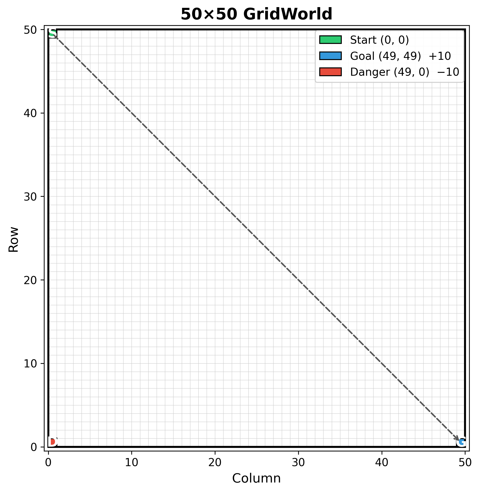
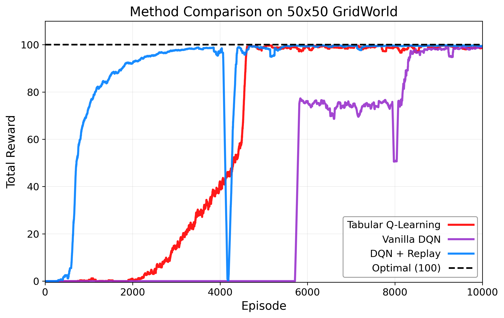

# Comparing Q-Learning Methods on a GridWorld Environment

> Part of my dissertation exploring the foundations of reinforcement learning. This experiment compares how different Q-learning approaches scale on a simple navigation task: a 50 x 50 open gridworld.

---

## Environment

<table>
<tr>
<td>

| Property | Value |
|---|---|
| Grid size | 50 × 50 (2,500 states) |
| Layout | Open, no internal walls |
| Start | Top left corner `(0, 0)` |
| Goal | Bottom right corner `(49, 49)`, reward **+10** |
| Danger zone | Bottom left corner `(49, 0)`, reward **−10** |
| Step penalty | **-1** per time step |
| Max steps | 200 per episode |
| Actions | Up, Down, Left, Right |

</td>
<td>

</td>
</tr>
</table>

The step penalty encourages the agent to find short paths rather than wandering.

---

## Methods

### 1. Tabular Q-Learning
The classic approach: stores a Q-value for every `(state, action)` pair in a lookup table and updates via the Bellman equation. Simple and effective for small discrete state spaces.

### 2. Vanilla DQN
Replaces the Q-table with a neural network (2 hidden layers x 64 neurons, ReLU activations). The network takes normalised `(x, y)` coordinates as input and outputs Q-values for each action. Trained using a single transitions with no replay.

### 3. DQN + Experience Replay
Same network architecture, but transitions are stored in a replay buffer (capacity 10,000) and the network is trained on random mini-batches of size 64. This breaks the temporal correlation between consecutive experiences.

### 4. DQN + Replay + Target Network
Builds on the above by adding a separate target network, a frozen copy of the Q-network that is synced every 100 steps. This stabilises the TD target during training.

---

## Hyperparameters

| Parameter | Tabular | DQN variants |
|---|---|---|
| Learning rate (alpha) | 0.5 | 0.001 (Adam) |
| Discount factor (gamma) | 1.0 | 1.0 |
| ε start -> end | 1.0 -> 0.01 | 1.0 -> 0.01 |
| ε decay | 0.999 / episode | 0.999 / episode |
| Hidden layers | - | 2 x 64 (ReLU) |
| Replay buffer | - | 10,000 |
| Batch size | - | 64 |
| Target net sync | - | every 100 steps |
| Episodes | 10,000 | 10,000 |

---

## Results

<p align="center">
  
</p>

The plot shows the moving-average total reward (normalised to 0-100) over 10,000 training episodes. Key takeaways:

- **Tabular Q-Learning** Requires a table of 2,500 × 4 = 10,000 entries, which is starting to slow down now the state space is getting larger. 
- **Vanilla DQN** is the most unstable. Training on single consecutive transitions means the network sees highly correlated data, which makes learning noisy.
- **DQN + Replay** improves stability significantly by breaking temporal correlations.
- **DQN + Replay + Target** adds a frozen target network that is only synced periodically, preventing the TD target from shifting every gradient step, overall best results.

---

## Quick Start

```bash
# install dependencies
pip install -r requirements.txt

# train all four methods (writes results.csv)
python compare_methods.py

# generate the comparison plot (writes method_comparison.png)
python plot_results.py
```

Training takes roughly 5–10 minutes depending on hardware (GPU not required — the grid is small enough for CPU).

---

## Project Structure

```
clean_comparison/
├── agents/
│   ├── __init__.py
│   ├── tabular_agent.py    # Tabular Q-learning agent
│   └── dqn_agent.py        # DQN agent (replay & target net toggleable)
├── environment.py           # 50×50 open GridWorld
├── compare_methods.py       # Trains all four methods → results.csv
├── plot_results.py          # Reads CSV → method_comparison.png
├── requirements.txt         # numpy, torch, matplotlib
└── README.md
```

---

## Dependencies

- Python 3.8+
- NumPy
- PyTorch
- Matplotlib
