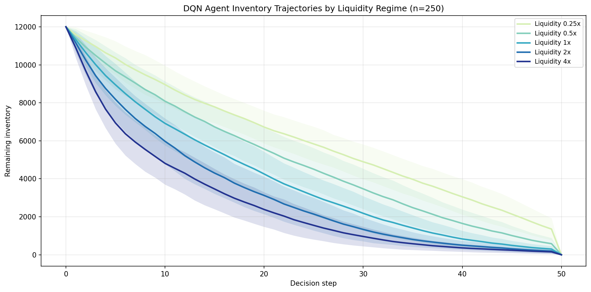
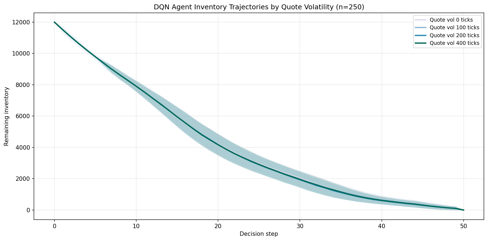
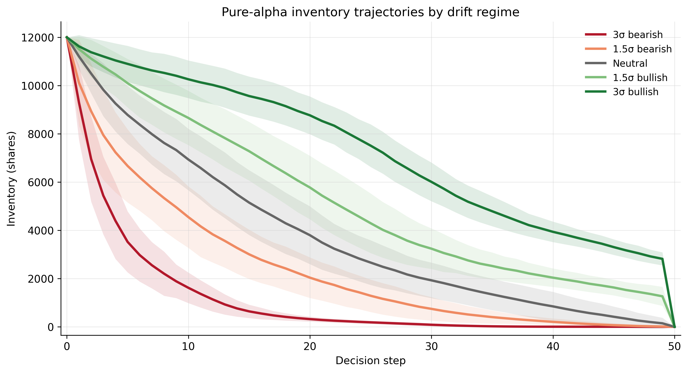
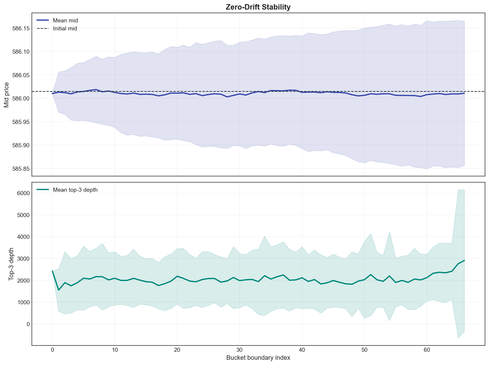

# Optimal Execution with Deep Q-Learning

This repository contains the code used for part of Matthew Millward's Durham University BSc Mathematics dissertation, *Deep Q-Learning for Optimal Execution in Financial Markets*.

## Project overview

Optimal execution is the problem of completing a large trade while balancing two competing costs:

- trading too quickly creates market impact and worsens execution prices;
- trading too slowly leaves the trader exposed to adverse price movements.

This project approaches the problem by training a Deep Q-Network (DQN) agent in a simulated limit order book. The simulator is calibrated from historical order book data and is designed to reproduce the main features needed for execution experiments: stochastic order flow, finite visible liquidity, non-zero bid-ask spread, realised volatility, and market impact.

The learned policy is then evaluated against fixed benchmark strategies and Almgren-Chriss style schedules across different market regimes.

The code in this repository:
1. calibrates market parameters from historical LOBSTER order book data;
2. constructs a stochastic limit order book simulator from the calibrated parameters;
3. trains a Double DQN agent to sell inventory over a fixed horizon;
4. evaluates the learned policy against benchmark execution strategies;
5. tests the policy across liquidity, volatility, drift, and alpha-signal regimes;
6. generates plots and tables used in the dissertation results and appendices.

For a short description of what each file does, see [`FILE_GUIDE.md`](FILE_GUIDE.md).

## Results

### Almgren-Chriss style trajectory comparison

Under idealised Almgren-Chriss conditions, the DQN agent recovers the optimal trading strategy.


### Inventory trajectories under liquidity regimes

This plot shows how the baseline DQN agent behaves when the market is exposed to varying liquidity regimes.



### Inventory trajectories under volatility regimes

This plot shows how the baseline DQN agent behaves when the market is exposed to volatility shocks.




### Inventory trajectories under drift regimes

This plot shows how an agent with an additional alpha feature behaves when the market is exposed to directional drift regimes.



### Simulator validation

The simulator was checked against calibrated market data and internal consistency tests. These checks include order-flow behaviour, depth, spread, realised volatility, temporary impact, permanent impact, and neutral-drift stability.



## Example evaluation result

One saved evaluation summary is available at:

- `runs/alpha_mid_risk/eval_refined/main_summary.md`

For that run, over 250 evaluation episodes:

- the DQN agent had mean implementation shortfall `2408.75`;
- TWAP had mean implementation shortfall `2731.84`;
- the DQN agent had the best mean reward in that table at `-1307.47`.

In that experiment, the learned policy outperformed the standard benchmark schedules on mean implementation shortfall.

## Main findings

Across the dissertation experiments, the main findings were:

- under idealised Almgren-Chriss style conditions, the learned policy recovers classical execution behaviour;
- in the calibrated limit order book setting, the DQN adapts most clearly to observable liquidity conditions;
- when volatility or drift must be inferred indirectly from realised price movements, the baseline policy shows limited systematic adaptation;
- adding an explicit alpha signal allows the agent to respond more clearly to directional regimes;
- simulator validation suggests that the environment captures the broad market properties needed for the execution experiments, while still remaining a simplified model of real market dynamics.

## Running the code

Install dependencies with:

```bash
pip install -r requirements.txt
```

To calibrate market parameters:

```bash
python -m calibration.calibrate
```

To train the agent:

```bash
python -m rl.train
```

To evaluate a trained model:

```bash
python -m evaluation.evaluate_refined --run-dir runs/no-alpha
```

The main settings are currently defined near the top of the calibration, training, and evaluation scripts.

## Requirements

Dependencies are listed in `requirements.txt`.

## Author

Matthew Millward  
BSc Mathematics, Durham University
